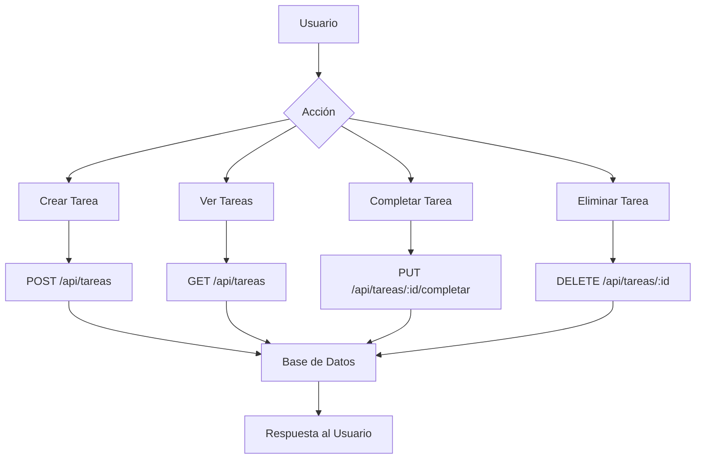

# Gestor de Tareas

Este es un simple gestor de tareas con una interfaz web y un backend construido con Node.js y Express.

## API Endpoints

| Método | Ruta                | Descripción                  |
|--------|---------------------|------------------------------|
| POST   | /api/tareas         | Crea una nueva tarea.        |
| GET    | /api/api/tareas         | Obtiene todas las tareas.    |
| PUT    | /api/tareas/:id     | Actualiza una tarea.         |
| PUT    | /api/tareas/:id/completar | Marca una tarea como completada.|
| DELETE | /api/tareas/:id     | Elimina una tarea.           |

## Pruebas

El proyecto incluye los siguientes tipos de pruebas, ejecutadas con Jest y Bun Test:

-   **Caja Blanca (`caja_blanca.test.js`):** Estas pruebas se centran en la estructura interna y el funcionamiento del código. Por ejemplo, verifican cómo la aplicación maneja errores internos, como una falla simulada en la conexión a la base de datos, asegurando que se devuelva un código de estado 500.
-   **Caja Gris (`caja_gris.test.js`):** Estas pruebas operan con un conocimiento parcial de la estructura interna de la aplicación. Un ejemplo es la simulación de una conexión a la base de datos (`mocked connection`) para probar el comportamiento de los componentes que interactúan con ella, sin depender de una conexión real.
-   **Caja Negra (`caja_negra.test.js`):** Estas pruebas evalúan la funcionalidad de la aplicación desde la perspectiva del usuario, sin conocimiento de su implementación interna. Por ejemplo, se verifica que la API devuelva un error 400 cuando se intenta crear una tarea sin un título, validando el manejo de entradas inválidas.
-   **Flujo (`flujo.test.js`):** Estas pruebas verifican un proceso completo dentro de la aplicación, simulando la interacción del usuario. Un ejemplo es el flujo de crear una tarea y luego verificar que esta tarea se pueda obtener correctamente a través de la API.
-   **Integración (`integration.test.js`):** Estas pruebas aseguran que los diferentes módulos o servicios de la aplicación funcionen correctamente cuando se combinan. Por ejemplo, se prueba la creación de una tarea y su posterior recuperación, verificando la interacción entre la API y la base de datos.
-   **Unitarias (`unit.test.js`):** Estas pruebas se enfocan en verificar el correcto funcionamiento de las unidades más pequeñas y aisladas del código. Un ejemplo es la prueba que asegura que la conexión a la base de datos se establece correctamente.

## Configuración de Pruebas (Jest)

El archivo `jest.config.js` en el directorio `backend` configura el entorno de pruebas para el proyecto:

```javascript
export default {
  testEnvironment: 'node',
  transform: {
    '^.+\.js$': 'babel-jest',
  },
  moduleFileExtensions: ['js', 'jsx'],
  transformIgnorePatterns: [
    '/node_modules/(?!(@paralleldrive/cuid2|supertest|formidable|superagent)/)',
  ],
  testMatch: ['**/tests/**/*.test.js'],
  verbose: true,
  collectCoverage: true,
  coverageDirectory: 'coverage',
  coverageReporters: ['html', 'text'],
};
```

**Detalles de la configuración:**

-   `testEnvironment: 'node'`: Especifica que el entorno de prueba es Node.js.
-   `transform: { '^.+\.js$': 'babel-jest' }`: Configura Babel para transformar archivos JavaScript, permitiendo el uso de sintaxis moderna.
-   `moduleFileExtensions: ['js', 'jsx']`: Define las extensiones de archivo que Jest debe buscar.
-   `transformIgnorePatterns`: Excluye la mayoría de los módulos de `node_modules` de la transformación, excepto aquellos que necesitan ser transformados (como `@paralleldrive/cuid2`, `supertest`, etc.).
-   `testMatch: ['**/tests/**/*.test.js']`: Indica a Jest que busque archivos de prueba con la extensión `.test.js` dentro de cualquier subdirectorio `tests`.
-   `verbose: true`: Muestra resultados de prueba detallados durante la ejecución.
-   `collectCoverage: true`: Habilita la recolección de cobertura de código.
-   `coverageDirectory: 'coverage'`: Especifica el directorio donde se guardarán los informes de cobertura.
-   `coverageReporters: ['html', 'text']`: Configura los formatos de los informes de cobertura (HTML y texto).

## Estructura del Proyecto

```
gestorTareas/
├── backend/
│   ├── .gitignore
│   ├── app.js
│   ├── bun.lock
│   ├── db.js
│   ├── jest.config.js
│   ├── package.json
│   ├── tareas.db
│   ├── routes/
│   │   └── tareas.js
│   └── tests/
│       ├── caja_blanca.test.js
│       ├── caja_gris.test.js
│       ├── caja_negra.test.js
│       ├── flujo.test.js
│       ├── integration.test.js
│       └── unit.test.js
└── frontend/
    └── index.html
```

## Diagramas

### Flujo de Pruebas y Validación

```mermaid
graph TD
    subgraph Nivel de Abstracción
        A[Unitarias] --> B(Validan: Funciones/Módulos individuales, como la conexión a la DB en `unit.test.js`)
        B --> C[Caja Blanca] --> D(Validan: Lógica interna, manejo de errores, rutas de código, como el error 500 en `caja_blanca.test.js`)
        C --> E[Caja Gris] --> F(Validan: Comportamiento con conocimiento parcial de la estructura, como la simulación de conexión a DB en `caja_gris.test.js`)
        E --> G[Integración] --> H(Validan: Interacción entre componentes, API y DB, como crear y listar tareas en `integration.test.js`)
        G --> I[Caja Negra] --> J(Validan: Funcionalidad externa, requisitos del usuario, como el error 400 sin título en `caja_negra.test.js`)
        J --> K[Flujo] --> L(Validan: Secuencias completas de usuario, casos de uso, como el flujo completo de tareas en `flujo.test.js`)
    end

    subgraph Enfoque
        M[Unitarias] -- Aislamiento --> N(Componentes pequeños)
        N -- Combinación --> O[Integración] -- Sistema Completo --> P[Caja Negra]
        P -- Interno --> Q[Caja Blanca]
        Q -- Parcial --> R[Caja Gris]
        R -- Secuencia --> S[Flujo]
    end

    subgraph Relación con el Código
        T[Caja Blanca] -- Código Interno --> U(db.js, app.js, routes/tareas.js)
        U -- Interacción --> V[Caja Gris] -- API Endpoints --> W[Caja Negra]
        W -- Flujos de Usuario --> X[Flujo]
    end
```



### Flujo de la Aplicación (Ejemplo: Gestión de Tareas)



## Pruebas Adicionales y Consideraciones

Para mejorar aún más la robustez del proyecto, se podrían considerar las siguientes pruebas adicionales y aspectos:

-   **Pruebas de Rendimiento:** Evaluar el comportamiento de la aplicación bajo carga para identificar cuellos de botella y asegurar que cumple con los requisitos de rendimiento.
-   **Pruebas de Seguridad:** Realizar pruebas de penetración y análisis de vulnerabilidades para proteger la aplicación contra ataques comunes (ej. inyección SQL, XSS).
-   **Pruebas de Usabilidad:** Evaluar la facilidad de uso de la interfaz de usuario con usuarios reales para identificar problemas de diseño y mejorar la experiencia del usuario.
-   **Pruebas de Compatibilidad:** Asegurar que la aplicación funcione correctamente en diferentes navegadores, dispositivos y sistemas operativos.
-   **Manejo de Errores en el Frontend:** Implementar pruebas para verificar que el frontend maneja y muestra adecuadamente los errores provenientes del backend.
-   **Validación de Entradas:** Ampliar las pruebas de caja negra para cubrir un rango más amplio de entradas inválidas y casos extremos en todos los endpoints de la API.
-   **Autenticación y Autorización:** Si se implementa un sistema de usuarios, añadir pruebas exhaustivas para la autenticación (login, registro) y autorización (permisos de usuario).
-   **Pruebas de Integración Continua/Despliegue Continuo (CI/CD):** Configurar un pipeline de CI/CD para ejecutar automáticamente las pruebas en cada cambio de código, asegurando la calidad de forma continua.
